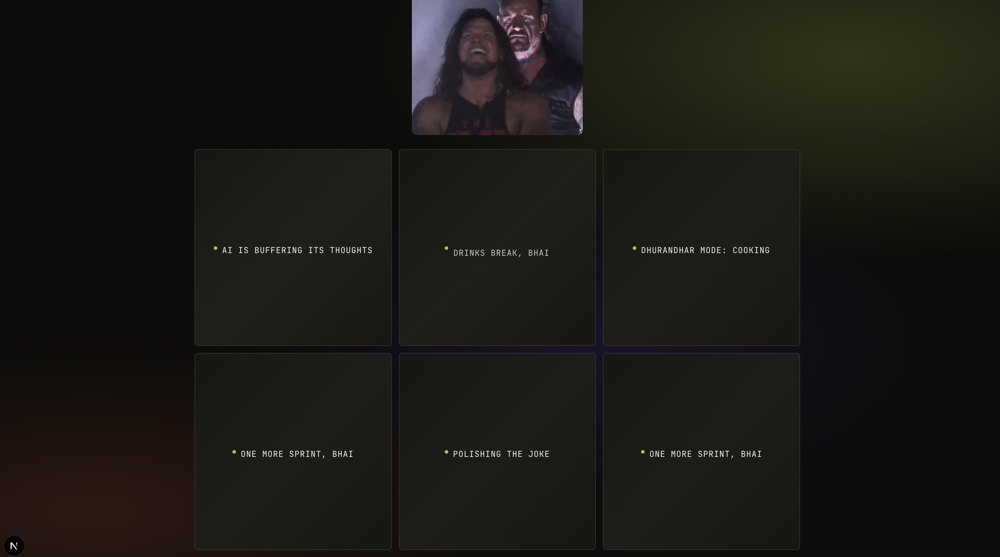
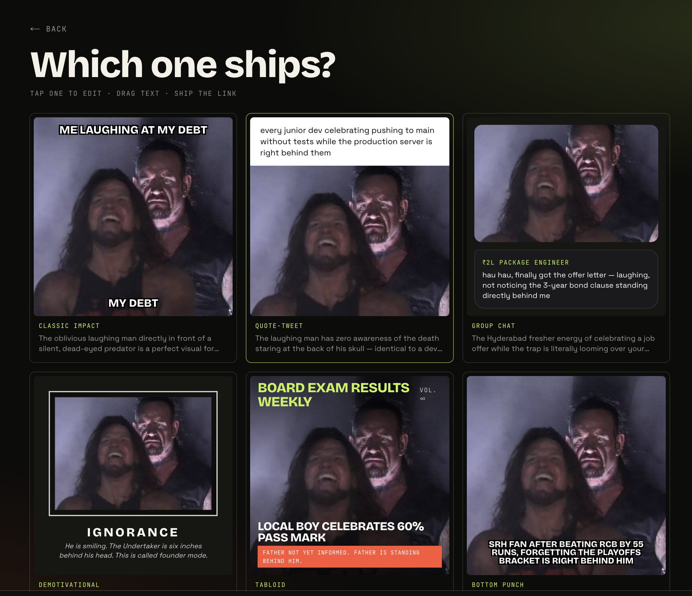
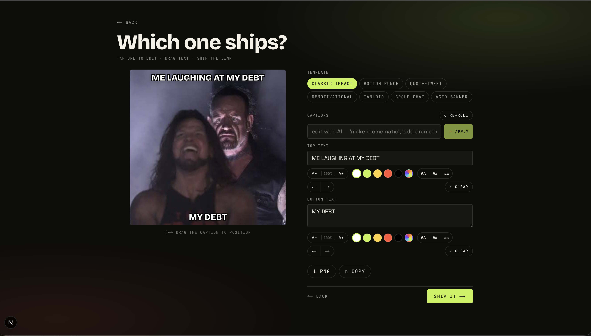
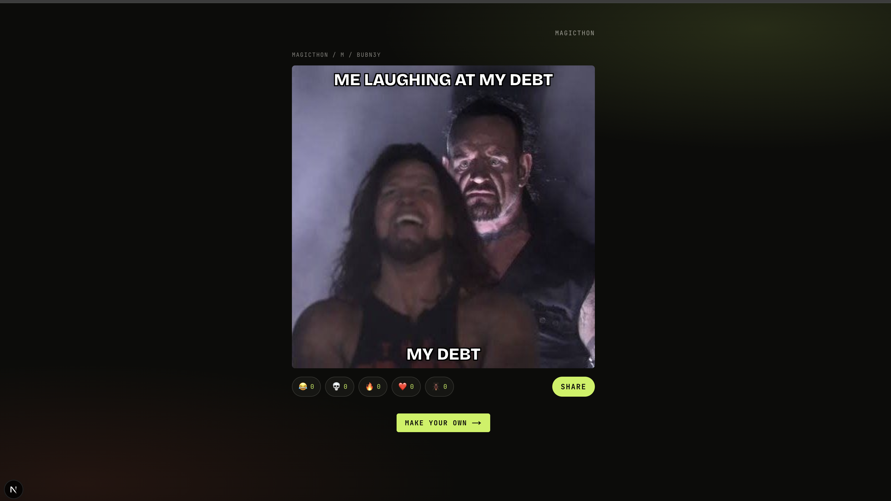

# 🪳 magicthon

> Make it a meme. Drop a photo, the vision model writes captions across templates, edit live, ship a link, watch reactions land in real time.

Built for the **Magicthon** hackathon (Hyderabad, May 2026).

- **Live:** https://magicthon-xt95.vercel.app
- **Brief:** https://magicathon.instaheadshots.com

---

## Screens


*Landing — animated aurora, hero meme rotates, glass dropzone right where your eye lands.*


*The wait is the product. 100+ slang lines (`ruk jaa bhai`, `claude is squinting at your photo`, `dhurandhar mode: cooking`, `drinks break, bhai`, `polishing the joke`) cycle inside every loading tile.*


*Six photo-grounded takes across six different templates. Every one references the photo specifically — no generic "POV:" captions.*


*Tactile editor: drag any caption, scale, recolor (5 swatches + free picker), case toggle, X/Y nudge, clear, re-roll, and `edit with AI` that ships the rendered meme to Gemini for a fresh background.*


*Public link, no signup, reactions stream in live. `/m/<code>` links preview as the meme on WhatsApp, Twitter, Slack via dynamic OG images.*

---

## What it does

1. **Drop a photo** (drag, paste, or pick from gallery). Or skip — type a topic in text mode.
2. **Cook** — a vision model looks at the photo and writes captions across a set of templates (Impact, demotivational poster, magazine cover, group-chat screenshot, banner, caption-above…).
3. **Pick** one. Each suggestion previews with your actual photo.
4. **Edit** in a tactile canvas: drag captions anywhere, scale them, recolor them, swap templates, toggle case, re-roll the captions, regen the background (text mode), wipe a slot, export PNG, copy to clipboard.
5. **Ship** a share link. Anyone opens it without signing in, reacts with 😂 / 💀 / 🔥 / ❤️ / 🪳. Reactions stream in **live** for everyone watching.
6. **The wall** at `/wall` shows every meme made, realtime. New ones glow in.

A `🪳` floating helper at the bottom-right is **Bawa** — an in-app chat helper that explains the product and collects feedback.

---

## Stack

| Layer | What |
| --- | --- |
| Framework | **Next.js 16** (App Router, Server Components, Turbopack) |
| Language | TypeScript, strict |
| Styling | **Tailwind CSS 4** (custom palette: acid green / ink / paper / hot) |
| Fonts | Bricolage Grotesque (display), Space Grotesk (body), JetBrains Mono (mono) — all subsetted, `display: swap` |
| Hosting + CI | **Vercel** (autodeploy from `main` via GH integration; CLI fallback via `vercel --prod`) |
| DB + storage + realtime | **Supabase** — Postgres + Storage (public `memes` bucket) + Realtime publication on `memes`, `reactions`, `feedback` |
| LLM gateway | **OpenRouter** (hackathon-provided key) |
| Caption + chat model | `anthropic/claude-sonnet-4.6` |
| Image-gen model | `google/gemini-2.5-flash-image` (returns inline base64 PNG via OpenRouter, then uploaded to Supabase Storage) |
| Validation | **zod** for every API surface |
| Short codes | **nanoid** with a custom alphabet (no 0/o/l/i/1 confusables) |
| PNG export | **html-to-image** (lazy-loaded inside the editor only) |
| OG / Twitter cards | Next.js `ImageResponse` (1200×630 per meme, edge-cacheable) |

No auth, no backend service of our own — everything's serverless on Vercel + Supabase.

---

## Why this stack

### Next.js 16 (App Router, RSC, Turbopack)
Server Components mean the meme grid, the wall, OG cards, and observations all render server-side with zero JS shipped. Only the editor, viewer reactions, and the Bawa widget ship JS. Page weight stays small with no manual code-splitting. One framework covers UI + API routes + image generation (`ImageResponse` for OG cards) + middleware + static serving — no separate Express/Hono backend. Vercel-native (streaming, edge), built-in `next/font` for subsetted Google fonts with `display: swap`.

### TypeScript, strict
Hackathon means refactoring on the hour. Strict TS catches API drift between client and server — caught 3 such bugs while extending `SlotAdjust` from `{dy}` → `{dx, dy, scale, color, textCase}`.

### Tailwind 4
No file-switching while iterating. Custom palette is one `@theme inline` block in `globals.css` (`--color-acid`, `--color-ink`, …); every component reads from it. Container queries (`cqw`) let meme captions scale to the meme box, not the viewport — critical for the masonry wall and editor preview.

### Fonts: Bricolage Grotesque / Space Grotesk / JetBrains Mono
Chunky display font for posters, legible-with-quirks body, mono for eyebrows and slang ticker. All subsetted to `latin`, all `display: swap` (no FOIT).

### Vercel
Native Next.js integration — Image optimization, Edge runtime, ImageResponse, streaming all work out of the box. Free tier handles the workload. `git push` → autodeploy in ~25s; `vercel env` / `vercel --prod` from local for hot-fix flow.

### Supabase
Postgres + Object Storage + Realtime + RLS in one SDK. Realtime over Postgres LISTEN/NOTIFY drives the live wall — when a row lands in `reactions` or `memes`, every browser gets it in <500ms. Without that we'd need WebSockets or polling. RLS lets us go anonymous-public safely (no signup, but no spam at the DB level). One backend, one bill.

### OpenRouter (LLM gateway)
One key, every model. Captions/chat use `anthropic/claude-sonnet-4.6`, image generation uses `google/gemini-2.5-flash-image`, both through the same `chat/completions` endpoint with one auth header. Switching models is one string change. The hackathon explicitly provides an OpenRouter key — billing is taken care of for us. OpenAI-compatible API surface means low risk.

### Claude Sonnet 4.6 for captions + chat
3-4× cheaper and 2× faster than Opus 4.7. Caption quality on this task (vision → multi-template JSON, Indian/Hyderabadi voice handling) is already excellent in our testing. Opus only when we genuinely need it; we don't.

### Gemini 2.5 Flash Image for backgrounds
Returns the image inline as base64 in a single OpenRouter call — no polling, no second call. ~3-5s per image, ~$0.04 each. Six in parallel = ~6-10s total. We tried Pollinations first (free, Flux-backed) but cold-start was 30-60s and browsers gave up. Gemini's reliability pays for itself in demo-day risk.

### zod
Every API surface — `/api/suggest`, `/api/memes`, `/api/reroll`, `/api/edit-image`, `/api/feedback`, `/api/chat` — parses its body with a zod schema before doing anything. Same goes for the model's JSON output. `z.infer` gives us TS types that match runtime checks. Bad input dies at the door.

### nanoid with custom alphabet
Default nanoid alphabet has `0/o/l/I/1/-` — visually confusable. Share URLs get verbally shared too. Custom alphabet `abcdefghkmnpqrstuvwxyz23456789` at 6 chars gives 36 billion possibilities, zero collision risk at hackathon scale, and is readable when scrawled on a sticky note.

### html-to-image (lazy-loaded)
The meme is already DOM (Tailwind + container queries). Re-implementing as canvas drawing commands would mean maintaining two renderers. html-to-image walks the live DOM and serializes to PNG. We lazy-load it (`await import("html-to-image")` inside the export click handler) so non-editor pages don't pay the ~20KB.

### Next.js `ImageResponse` for OG cards
One file (`/api/og/[code]/route.tsx`) renders a 1200×630 PNG per meme on demand using a JSX subset. Edge-cacheable (`s-maxage=86400`). Drops directly into `og:image` + `twitter:image` via `generateMetadata`. WhatsApp / Twitter / Slack previews work out of the box.

### Conscious "no" choices
- **No auth** — brief says no signup wall. Anonymous reads + inserts via RLS.
- **No standalone backend** — every endpoint is a Next.js route handler. Serverless scales it. No servers to manage.
- **No state in our process** — all state lives in Supabase; functions are stateless, scale to zero.

---

## Routes

| Path | What |
| --- | --- |
| `/` | Landing: rotating hero meme, copy diff vs other tools, live wall preview, CTA. |
| `/create` | Photo flow → suggestion grid → editor → ship. |
| `/text` | Text flow → topic input → generated-image suggestions → editor → ship. |
| `/m/[code]` | Share page: renders the meme, public reactions with realtime counts. |
| `/wall` | Live global wall — server-rendered initial + Supabase realtime subscriptions for new memes and reactions. |

### API

| Endpoint | Purpose |
| --- | --- |
| `POST /api/suggest` | Photo → template-mapped captions (Claude Sonnet vision). |
| `POST /api/suggest-text` | Topic → captions + AI-generated backgrounds (Claude for captions, Gemini Flash Image for backgrounds). |
| `POST /api/reroll` | Single-template caption re-roll. |
| `POST /api/regen-image` | Single-template background re-gen with a fresh seed. |
| `POST /api/memes` | Persist a meme: photo → Supabase Storage, row → Postgres. |
| `POST /api/memes/[code]/react` | Append an emoji reaction. |
| `GET /api/og/[code]` | Dynamic OG/Twitter card image (1200×630 PNG). |
| `GET /api/stats` | Last-24h meme + reaction counts (for the live counter chip). |
| `POST /api/chat` | Bawa helper — Claude Sonnet with a tight system prompt. |
| `POST /api/feedback` | Persist anonymous feedback to Supabase. |

---

## Caption prompt — the moat

The Claude system prompt forces:

1. **Photo-specific captions only.** "If the caption fits any photo, it's wrong."
2. **Funny > clever > earnest.** No `POV:` or `When you...` crutches.
3. **Multiple different templates per response.**
4. **At least 2 lean Indian/Hyderabadi** — but only when the photo's vibe earns it.
5. **Cultural toolkit** baked in: Hyderabad slang (`hau`, `nakko`, `bawa`, `miya`, `light lo`), code-switch patterns (`haalat aisi hai ki…`, `wo wala feeling jab…`), dev humor (`.ai startups that are actually Indian devs`, LinkedIn cringe), evergreen Indian cues (Sharma ji ka beta, shaadi, cricket), May 2026 topicals (**Cockroach Janta Party**, IPL playoffs, monsoon).
6. **Hard cringe-blacklist** — no stacked `yaar/bhai`, no "Indian moms be like", no forced Hyderabad refs.

Output is `response_format: json_object`, zod-validated. The renderer handles overflow with auto-shrink + line wrap.

---

## Templates

All templates are **JSON recipes** (`src/lib/templates.ts`), not images:

- `top-bottom-impact` — classic Impact, top + bottom
- `bottom-only` — single big Impact line
- `caption-above` — white caption strip + photo
- `motivational` — black-mat demotivational poster
- `magazine-cover` — masthead + headline + kicker
- `screenshot-quote` — chat-screenshot style
- `banner-side` — photo + acid-green vertical caption panel

Every template renders the user's actual photo (or AI-generated background). Each slot can be dragged, scaled, recolored, case-toggled (Aa/AA/aa), nudged, or cleared in the editor.

---

## Engagement details

- **100+ rotating slang lines** in `src/lib/slang.ts` show inside every loading placeholder so the wait feels alive (`ruk jaa bhai itni kya jaldi hai`, `claude is squinting at your photo`, `🪳 voted cockroach janta party`, `Banjara Hills traffic dekhi hai?`).
- **Rotating hero copy** — eyebrow + subtitle each cycle through a small pool.
- **Live counters** on every page (`X memes / 24h · Y reactions`).
- **Realtime wall** — new memes appear with an acid glow + "✦ new" tag.
- **Share menu** — native Web Share API on mobile, popover with WhatsApp / X / Telegram / Reddit / LinkedIn / Email + copy-link on desktop.
- **OG images** so links preview as the meme in WhatsApp/Twitter.
- **Bawa bot** — in-app `🪳` button opens a Claude-Sonnet-powered helper that explains features in Hyderabadi voice; same panel collects feedback.

---

## Local dev

```bash
pnpm install
cp .env.example .env.local   # then fill in
pnpm dev
```

`.env.local` needs:

```
OPENROUTER_API_KEY=
NEXT_PUBLIC_SUPABASE_URL=
NEXT_PUBLIC_SUPABASE_ANON_KEY=
SUPABASE_SERVICE_ROLE_KEY=
```

Apply the schema once: paste `supabase/schema.sql` into the Supabase SQL editor. Also add:

```sql
create table if not exists public.feedback (
  id bigserial primary key,
  name text,
  message text not null,
  created_at timestamptz default now()
);
alter table public.feedback enable row level security;
create policy "anyone leaves feedback" on public.feedback
  for insert with check (true);
```

---

## Deploying

Production deploys to Vercel automatically when `main` is pushed (Git integration). If the Git auth ever drifts, deploy from local:

```bash
pnpm exec vercel --prod
```

---

## Brief checklist (the hackathon's 10 non-negotiables)

| # | Requirement | ✓ |
| --- | --- | --- |
| 1 | Accept photo upload (drag/paste/camera) | ✅ |
| 2 | Vision LLM with **structured** output | ✅ |
| 3 | ≥6 distinct templates as **reusable recipes** | ✅ 7 |
| 4 | Live previews using the **actual photo** | ✅ |
| 5 | Canvas editor — editable + **draggable** text, outline/shadow/wrap | ✅ |
| 6 | PNG export + copy-to-clipboard | ✅ |
| 7 | Shareable link, no signup, anyone reacts | ✅ |
| 8 | **Realtime** reactions to creator | ✅ Supabase realtime |
| 9 | Works on a **phone** | ✅ mobile-first |
| 10 | Any stack | ✅ |

Plus the stretch goals shipped: **global live wall**, **text-only meme generator**, **AI helper bot**, **OG images**, **Hyderabad-flavored cultural anchor in the captions**.

---

🪳 *built on build day in Hyderabad. memes that actually land.*
